# nexus-workflow-core — Architecture

## 1. Two-Project Overview

The workflow engine is split across two projects with a strict dependency direction.

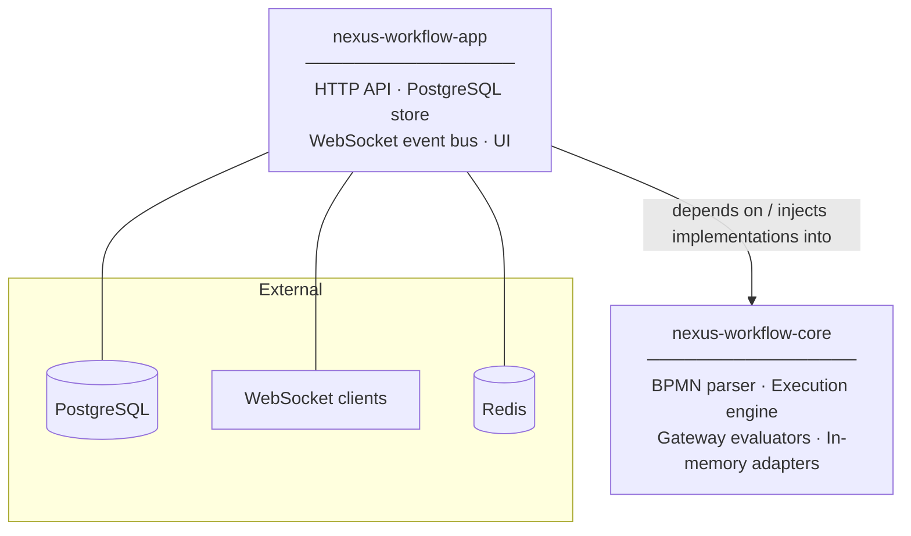

> **Rule:** `nexus-workflow-core` never imports HTTP libraries, database drivers, or filesystem APIs. Every I/O operation is abstracted behind an injected interface.

---

## 2. Core Module Structure

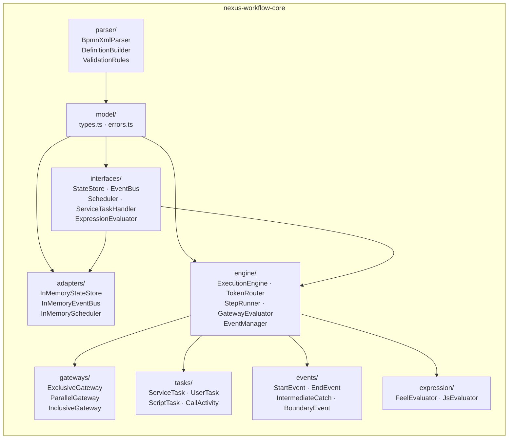

---

## 3. Execution Engine — Pure Function Model

The engine has **no side effects**. It is a pure transform of a command and current state into a new state and a list of events. Side effects (persistence, event emission) happen outside.

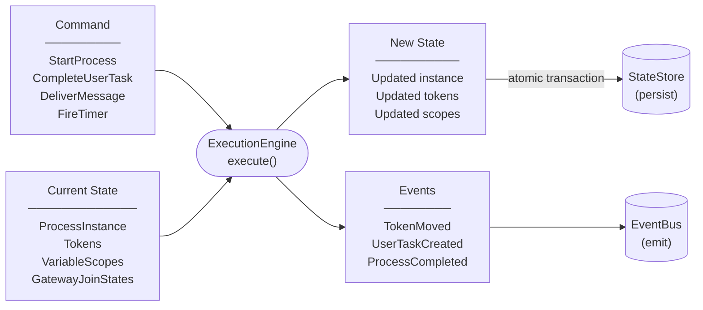

---

## 4. Execution Loop

When a command is applied, the engine runs tokens forward recursively until all are in a terminal or waiting state.

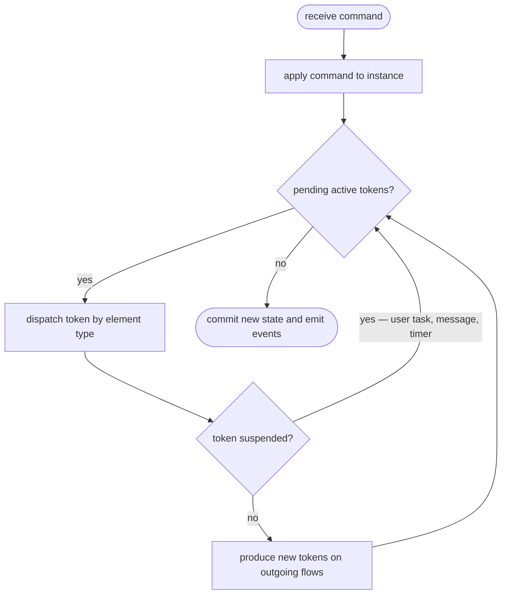

---

## 5. Token Lifecycle

A token is the unit of execution — one per concurrent branch of a process.

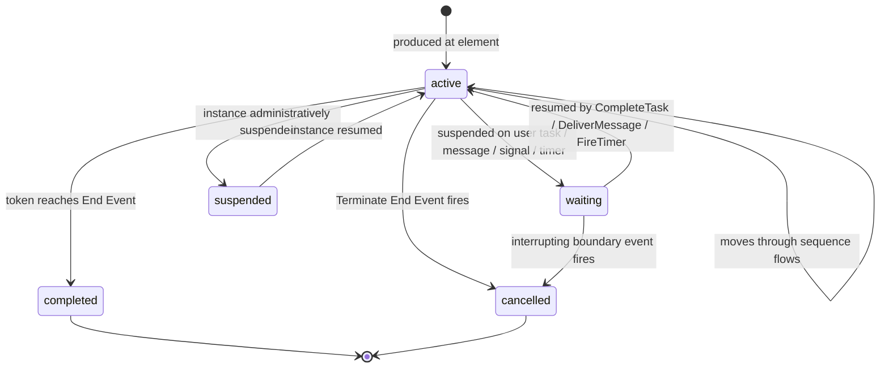

---

## 6. Process Instance Lifecycle

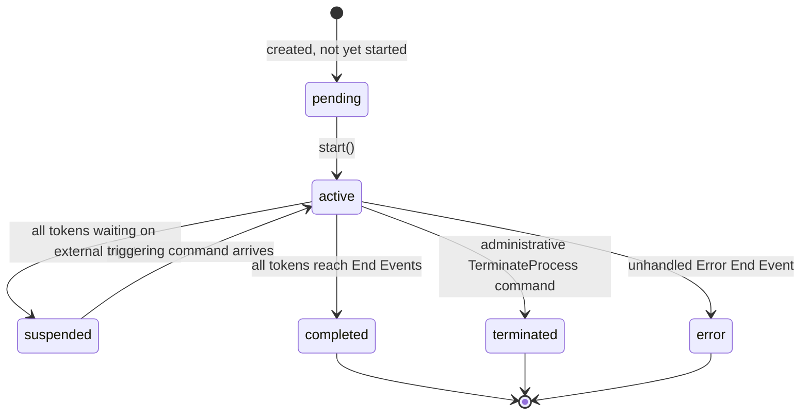

---

## 7. Gateway Semantics

### Exclusive Gateway (XOR)

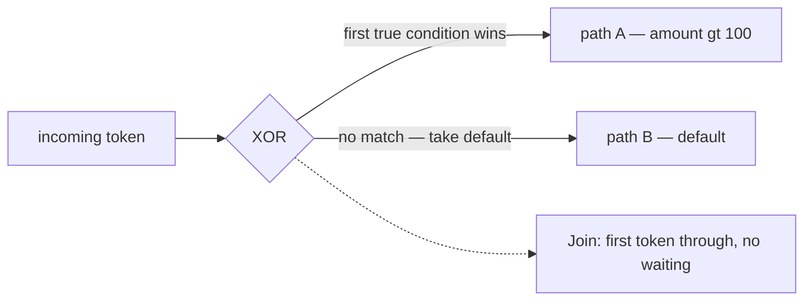

### Parallel Gateway (AND)

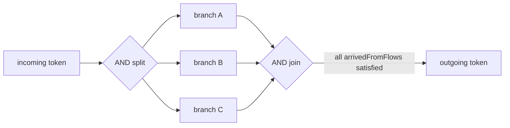

> Join state tracks `arrivedFromFlows` as a `Set<string>` — **not a count** — so loops are handled correctly.

### Inclusive Gateway (OR)

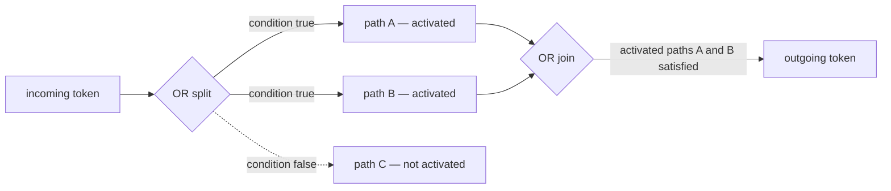

> The split records which paths were activated. The join fires when exactly those paths have arrived — not all incoming flows.

---

## 8. Message & Signal Correlation

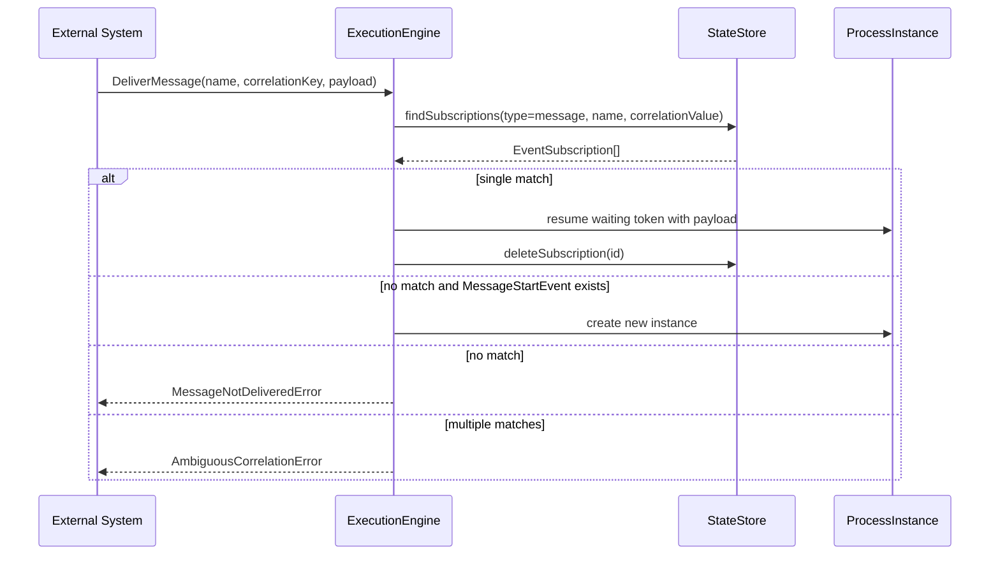

**Signal broadcast** (one-to-many):

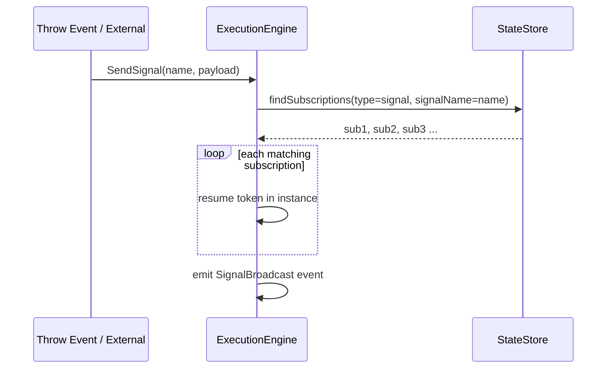

---

## 9. Boundary Event Handling

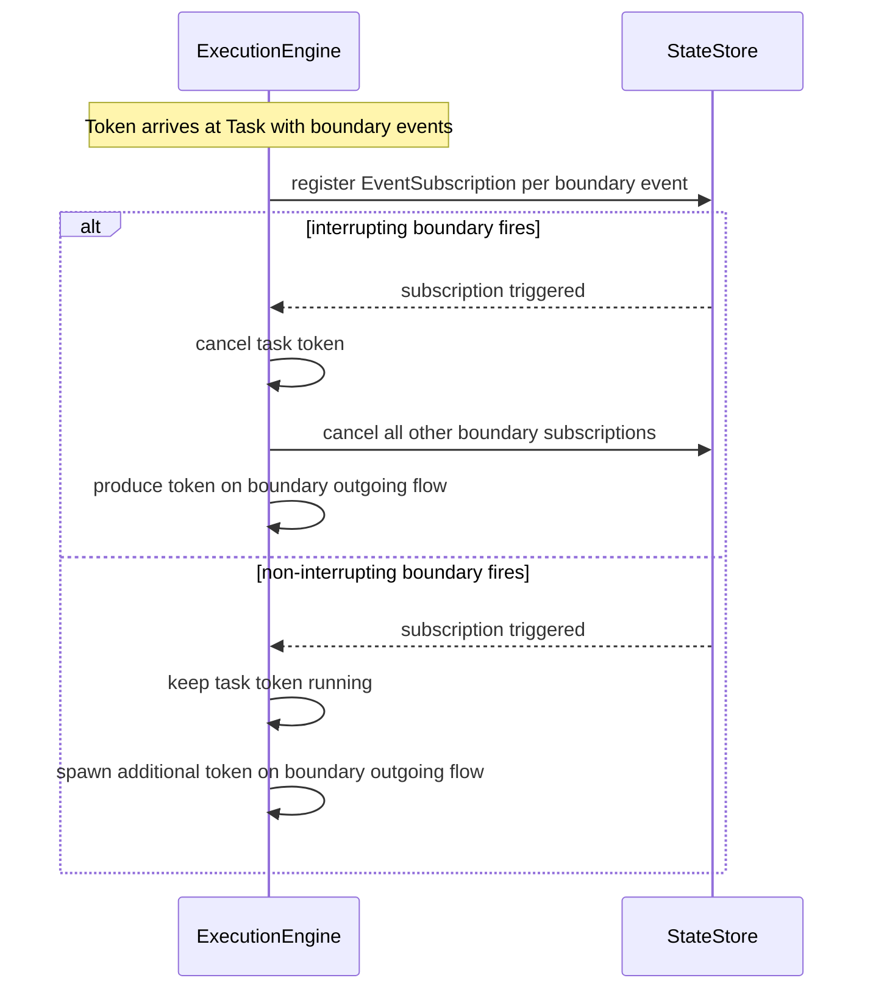

---

## 10. Dependency Injection Pattern

The host application wires the engine by injecting concrete implementations of all interfaces.

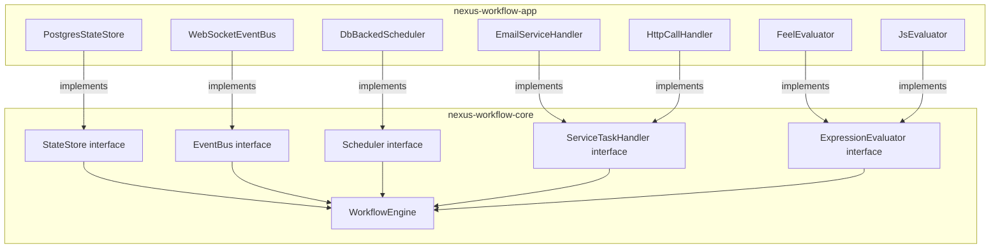

---

## 11. Testing Architecture

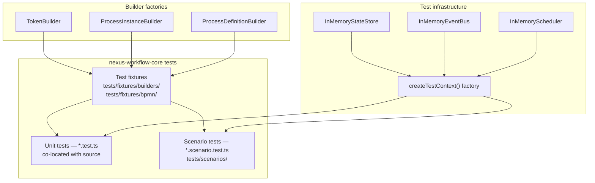

**Coverage thresholds:**

| Module | Lines | Branches |
|---|---|---|
| `src/engine/**` | 90% | 85% |
| `src/gateways/**` | 95% | 90% |
| `src/expression/**` | 90% | 85% |
| Global | 80% | 75% |
